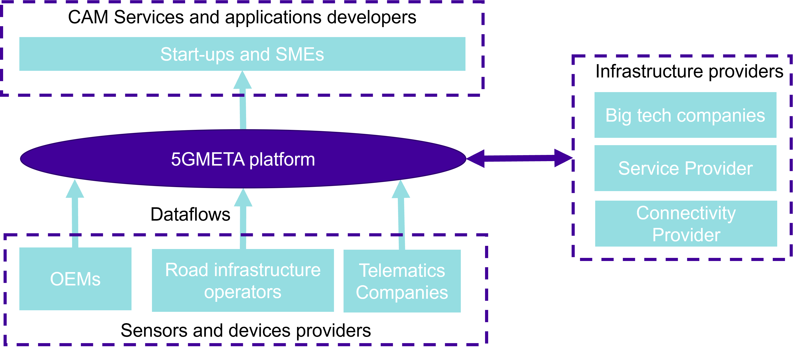

# User profiles definition

Considering the 5GMETA platform framework, three main profiles to interact with the data platform have been identified:

* CAM Services and applications developers
* Sensors and devices providers
* Infrastructure providers

Figure below illustrates the main relation of these different categories with the 5GMETA platform and the principal stakeholders for each of these three profiles.

The rest of this manuel is divided in three sections. Depending on how you intend to interact with 5GMETA platform, please select the apprpriate guide:

* [Guide for CAM applications developers](getting-started.md)
* [Guide for Sensors and devices providers](getting-started-sensor-provider.md)
* [Guide for Infrastructure providers](getting-started-infrastructure-provider.md)
