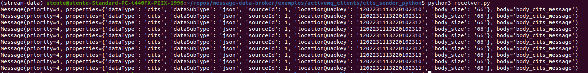

In this page, we introduce examples which can be run for C-ITS data type.

## Steps to run examples

The examples can be found in the folder [examples/message-data-broker/cits_sender_python](https://github.com/5gmeta/5gmeta-dev/tree/main/examples/message-data-broker/cits_sender_python).

- Modify [**address.py**](https://github.com/5gmeta/message-data-broker/blob/main/examples/activemq_clients/cits_sender_python/address.py) to put the ***appropriate ip***, ***port*** and ***topic*** given by **your message broker** or run with options:

- Additional arguments as highlighted below could be parsed to the [sender.py](https://github.com/5gmeta/message-data-broker/blob/main/examples/activemq_clients/cits_sender_python/sender.py) :
    ```
    - h, --help            show this help message and exit
    - a ADDRESS, --address=ADDRESS
        = address to which messages are sent (default amqp://<username>:<password>@192.168.15.34:5673/topic://cits)
    - m MESSAGES, --messages=MESSAGES
        = number of messages to send (default 100)
    - t TIMEINTERVAL, --timeinterval=TIMEINTERVAL
        = messages are sent continuosly every time interval seconds (0: send once) (default 10) 
    ```
- In one terminal window run wither of the sender scripts **depending upon whether you are running your S&D connected to an database or not**. You can add additional arguments as shown before:
    ```python3 sender.py``` or ```python3 sender_with_sd_database_support.py```

    Example output can be seen below:

    


- If you want to do some debugging and check if your messages are being sent run in another terminal to receive messages (you have to modify **address.py** in order to put the ***appropriate ip***, ***port*** and ***topic*** given by **your message broker**) :

    Run ```python3 receiver.py``` to see the received messages on the subscribed AMQP topic.

    

- Use the ActiveMQ admin web page to check Messages Enqueued / Dequeued counts match. 

- You can control which AMQP server the examples try to connect to and the messages they send by changing the values in **config.py**

- ***NB:*** You have to take into account that any modification made on dataflowmetadata must be applied too into the content.py file in order to generate the appropriate content.

## Pseudo movement example

This example demonstrates data being produced by a moving sensor device.

- Added some movement around a fixed GPS position in order to simulate movement.
    -  Example:

       - [cits_send_moving_location.py](https://github.com/5gmeta/5gmeta-dev/blob/main/examples/message-data-broker/cits_sender_python/cits_send_moving_location.py)

This way we can move around a MEC that covers tiles:

* 031333123201033
* 031333123201211

and a ***secondary one*** that covers tiles:

* 031333123201212
* 031333123201213
* 031333123201223
* 031333123202223

## Other resources
***The initial example for this client is at the [link](https://github.com/apache/activemq/tree/main/assembly/src/release/examples/amqp/python)***

    - *https://qpid.apache.org/releases/qpid-proton-0.36.0/proton/python/docs/tutorial.html*
    - *https://access.redhat.com/documentation/en-us/red_hat_amq/6.3/html/client_connectivity_guide/amqppython*


