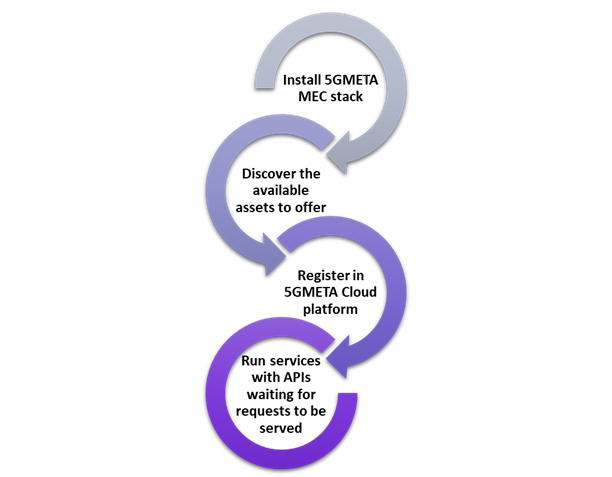

# MEC plaform deployement

The installation of all the SW stack of the MEC infrastructure, including the 5GMETA modules forming the 5GMETA MEC Stack, a unique Ansible playbook shall be used. 
The Ansible playbook installs all the dependencies and components and repositories necessary for the 5GMETA platform's MEC server. 
Furthermore, every time a change is made in the stack, it will be reflected in the playbook and running it again will update the deployment without extra effort.
The Ansible playbook includes :

* The baseline/default building blocks of the 5GMETA MEC platform defined in D2.3 (Definition of 5GMETA architecture).
* The introspection of HW assets to be offered to CCAM applications to process data or to host a low latency service.
* The register of all the information of the MEC platform in the Discovery service at the 5GMETA Cloud platform.
* The orchestration and instance type systems to instance pipelines and third-party services on demand.

The process is illustrated as follows:

