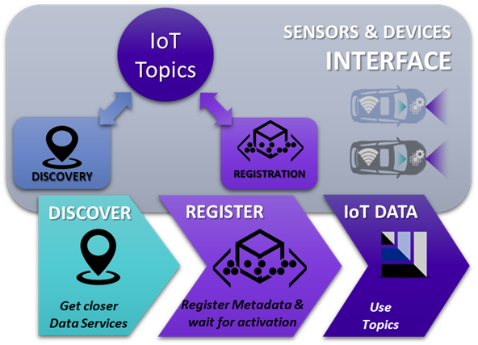

# Introduction to APIs for sensors and devices

The 5GMETA platform exposes a set of APIs for sensor and device developers to register and manage data flows to start sending Data to the platform, these building blocks include Discovery and Registration as described below.

1.	[Discovery](https://github.com/5gmeta/discovery): The building block allows Sensors and Devices developers to discover available MECs and their locations based on their geographical location and tile coverage to be forwarded to the nearest MEC to register your dataflow.
2.	[Registration](https://github.com/5gmeta/registration): This building block allows developers to register a data flow by providing metadata related to the data flow. The output of this method is a JSON containing the ID of the generated data flow, the topic where to publish, and a Boolean indicating whether or not there is a consumer listening for that type of data.

Once a consumer connects to the data registered, the 5GMETA platform will update the Boolean value in order to start producing data to the connected parties. This will trigger a keepalive mechanism to determine which data flows are still active. The output of this method is the same information retrieved at the registration, including the ID of the data flow and its metadata.

5GMETA platform supports three types of data provided by sensors and devices:

* CITS
    * json like messages with data extracted from the vehicle (ex: GPS position, etc)
    * [Example](https://github.com/5gmeta/5gmeta-dev/tree/main/tools/cits-example.json)
* images
    * jpg
* Video streaming