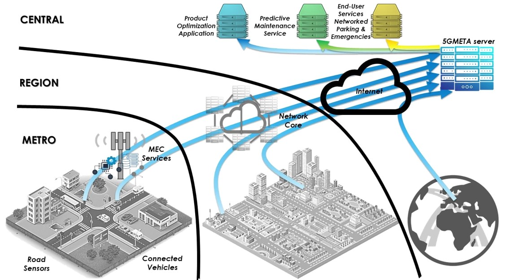
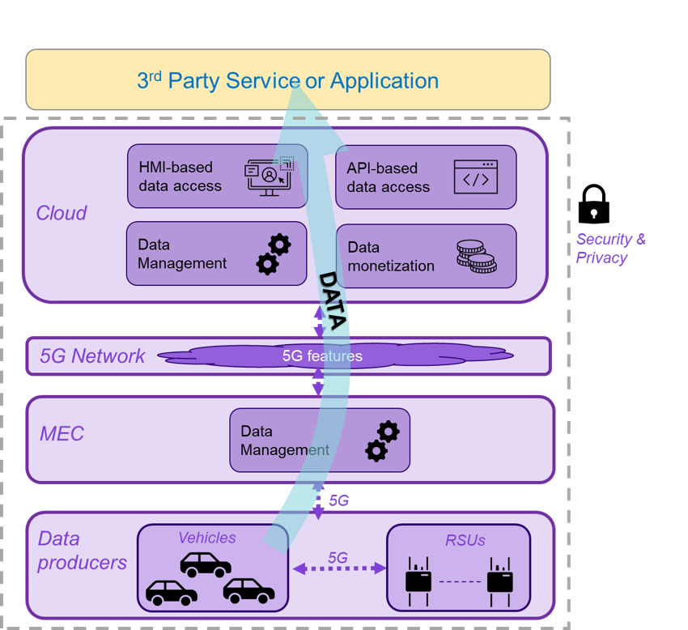

# 5GMETA Platform User Documentation

## What is the 5GMETA platform?
The 5GMETA open platform aims to leverage car-captured data to stimulate, facilitate and feed innovative products and services.
This platform intends to catalyse data and provide OEMs, SMEs and high-tech start-ups with them in order to feed their innovative services and ideas and, ultimately, generate revenues.

It is designed to operate as a common infrastructure for implementing data pipelines for heterogeneous Connected, Cooperative and Automated Mobility (CCAM) applications. 
The 5GMETA platform provides secure end-to-end data management services such as data anonymization, encryption, packaging/formatting, computing and sharing mechanisms.

## What does the 5GMETA platform do?

5GMETA consortium partners have been working to develop an interactive platform that functions as a broker between data producers (such as vehicles or road sensors) and data consumers (such as app providers). 
With the 5GMETA Platform, data consumers can subscribe to specific data flows and decide how to use and deploy them: process them, store them or discard them. 
The 5GMETA Platform allows data to be decoupled from their producers, thus eliminating the necessity of creating direct links between producers and consumers. 
Nevertheless, the 5GMETA Platform does not only act as a broker, but it also includes functions that address data management, data monetization and cybersecurity.

More information can be found in the 5GMETA project website ([https://5gmeta-project.eu/](https://5gmeta-project.eu/)).

## Table of Contents
In the next topics we will cover the following topics:

* Getting started
* User profiles definition
* Guide for CAM Application developpers
    * Getting started
    * Consuming guide
    * Dataset Guide
    * Producing Events Guide
    * Data Processing Tutorials
	
* Guide for Sensors and Devices Providers
    * Getting started
    * Producing C-ITS data guide
    * Producing images guide
    * Producing video streams guide
    * Receiving events guide
	
* Guide for Infrastructure Providers
    * Getting started
    * Instanciating a MEC stack
    * Instanciating low latency data services

* Additional resources
    * Advanced description
    * Message data broker
    * Stream data gateway
    * Additional examples
    * About