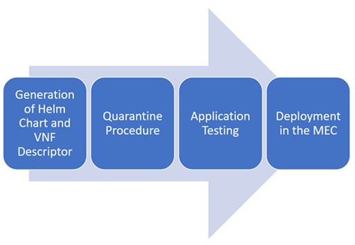

# Platform instantiation of Low Latency Data services

Third Parties utilizing the 5GMETA Platform can request the deployment of a CCAM application in a MEC Server of the 5GMETA platform. 
By leveraging the direct access to the 5G network of data producers, these deployments enable swift information retrieval, significantly reducing latency. 
Additionally, the MEC infrastructure offers optimized edge computing capabilities, enhancing scalability, reliability, and resource utilization.

To ensure the security and integrity of the MEC environment, a stringent deployment procedure is followed. 
The procedure for this deployment works as follows:

1. Contacting the 5GMETA Operator: the Third Party provides essential artifacts, including the Helm chart and the VNF (Virtual Network Function) descriptor, to the 5GMETA Operator.
2. Quarantine Procedure: the 5GMETA Operator deploys the application in a dedicated test environment.
3. Testing Application Behaviour: during this phase,  the 5GMETA Operator conducts comprehensive testing to validate the application correct behaviour. These tests verify the proper utilization of the MEC resources and the correct access to the 5GMETA data.
4. Deployment in the MEC environment: once the application passes the tests, it can be deployed on demand by the Third Party, using the same technical procedure used to deploy the modules of the MEC pipelines.
 
